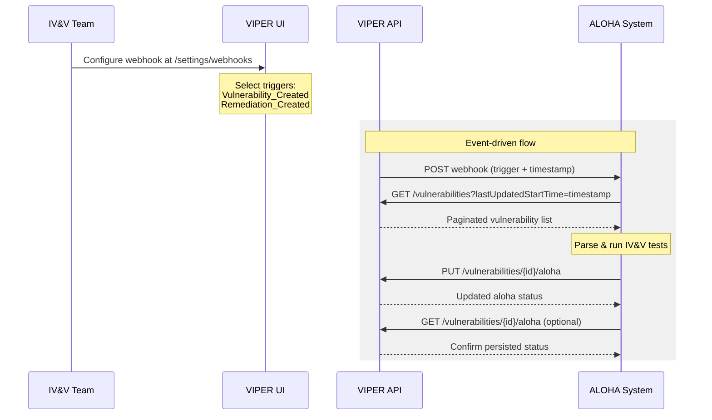

# ALOHA Integration Guide

This document describes the end-to-end workflow for integrating **ALOHA** (the IV&V testing system) with the **VIPER** Vulnerability Management Platform. ALOHA receives event notifications from VIPER via webhooks, queries for new or updated vulnerabilities and remediations, runs independent verification and validation (IV&V) testing, and reports results back through the ALOHA API endpoints.

## Authentication

All VIPER API calls require an API key passed as a Bearer token:

```http
Authorization: Bearer <API_KEY>
```

API keys can be created through the VIPER settings interface or during database seeding. Every request to `/api/v1/*` must include this header.

## Workflow Overview



## Step 1: Configure Webhooks in VIPER

The IV&V team configures a webhook in the VIPER frontend to receive notifications when vulnerabilities or remediations are created or updated.

1. Navigate to **Settings > Webhooks** (`/settings/webhooks`).
2. Click **Add Webhook** and fill in:
   - **Name**: A descriptive label (e.g. "ALOHA IV&V Notifications").
   - **Webhook URL**: The ALOHA callback endpoint that will receive event notifications.
   - **Authentication**: Choose an auth type (`None`, `Basic`, `Bearer`, or `Header`) depending on how ALOHA authenticates inbound requests.
   - **Triggers**: Select one or more of the following:
     - `Vulnerability_Created` -- fires when a new vulnerability is ingested.
     - `Vulnerability_Updated` -- fires when an existing vulnerability is modified.
     - `Remediation_Created` -- fires when a new remediation is created.
     - `Remediation_Updated` -- fires when an existing remediation is modified.
3. Save the webhook.

VIPER will now POST to the configured URL whenever a matching database event occurs.

## Step 2: Receive the Webhook

When a trigger fires, VIPER sends an HTTP `POST` to the configured callback URL. The payload contains the trigger type and a timestamp -- no entity IDs or record data are included.

**Webhook payload:**

```json
{
  "webhookTrigger": "Vulnerability_Created",
  "timestamp": "2026-03-03T12:00:00.000Z"
}
```

| Field | Type | Description |
|-------|------|-------------|
| `webhookTrigger` | `string` | The event that fired. One of: `Vulnerability_Created`, `Vulnerability_Updated`, `Remediation_Created`, `Remediation_Updated`. |
| `timestamp` | `string` (ISO 8601) | The time the database mutation occurred. Use this value for subsequent queries. |

The request includes a `Content-Type: application/json` header and any authentication headers configured on the webhook. VIPER enforces a 30-second timeout on webhook delivery.

## Step 3: Query for New or Updated Items

Use the `lastUpdatedStartTime` query parameter set to the webhook `timestamp` to retrieve only items created or modified since that point.

### Vulnerabilities

```http
GET /api/v1/vulnerabilities?lastUpdatedStartTime=2026-03-03T12:00:00.000Z
Authorization: Bearer <API_KEY>
```

### Remediations

```http
GET /api/v1/remediations?lastUpdatedStartTime=2026-03-03T12:00:00.000Z
Authorization: Bearer <API_KEY>
```

## Step 4: Parse Returned Items for Testing

ALOHA parses the returned vulnerability and remediation objects to determine what IV&V testing is needed.

## Step 5: Update ALOHA Status

After running IV&V tests, ALOHA reports results back to VIPER using the ALOHA update endpoints. Each vulnerability or remediation can be marked with an `AlohaStatus` and an optional freeform `log` object for audit details.

### AlohaStatus values

| Value | Meaning |
|-------|---------|
| `Confirmed` | IV&V testing confirmed the vulnerability or remediation. |
| `Unsure` | IV&V testing was inconclusive or requires further review. |

### Update vulnerability ALOHA status

```http
PUT /api/v1/vulnerabilities/{id}/aloha
Authorization: Bearer <API_KEY>
Content-Type: application/json
```

**Request body:**

```json
{
  "data": {
    "status": "Confirmed",
    "log": {
      "testedBy": "ALOHA-automated",
      "testDate": "2026-03-03T14:30:00.000Z",
      "note": "Exploit verified in emulator environment"
    }
  }
}
```

`log` has no restrictions and can take any JSON shape

### Update remediation ALOHA status

```http
PUT /api/v1/remediations/{id}/aloha
Authorization: Bearer <API_KEY>
Content-Type: application/json
```

Same request body as above.

### Response

Both PUT endpoints return the full entity alongside the updated ALOHA data:

```json
{
  "vulnerability": { "id": "...", "severity": "High", ... },
  "aloha": {
    "status": "Confirmed",
    "log": { "testedBy": "ALOHA-automated", ... }
  }
}
```

For remediations, "vulnerability" is of course replaced with "remediation".

## Step 6: Check ALOHA Status

ALOHA can verify the persisted status of any vulnerability or remediation at any time using the GET endpoints.

### Get vulnerability ALOHA status

```http
GET /api/v1/vulnerabilities/{id}/aloha
Authorization: Bearer <API_KEY>
```

### Get remediation ALOHA status

```http
GET /api/v1/remediations/{id}/aloha
Authorization: Bearer <API_KEY>
```

### Response

```json
{
  "vulnerability": {
    "id": "clxyz...",
    "cveId": "CVE-2026-12345",
    "severity": "High",
    "cvssScore": 8.2,
    "description": "...",
    "affectedDeviceGroups": [ ... ],
    ...
  },
  "aloha": {
    "status": "Confirmed",
    "log": {
      "testedBy": "ALOHA-automated",
      "testDate": "2026-03-03T14:30:00.000Z",
      "note": "Exploit verified in emulator environment"
    }
  }
}
```

The `aloha.status` field is `null` when no IV&V assessment has been submitted. The `aloha.log` defaults to `{}`.

## API Reference

| Method | Path | Description |
|--------|------|-------------|
| `GET` | `/api/v1/vulnerabilities` | List vulnerabilities (supports `lastUpdatedStartTime`, pagination). |
| `GET` | `/api/v1/remediations` | List remediations (supports `lastUpdatedStartTime`, pagination). |
| `GET` | `/api/v1/vulnerabilities/{id}/aloha` | Get ALOHA status and log for a vulnerability. |
| `PUT` | `/api/v1/vulnerabilities/{id}/aloha` | Update ALOHA status and log for a vulnerability. |
| `GET` | `/api/v1/remediations/{id}/aloha` | Get ALOHA status and log for a remediation. |
| `PUT` | `/api/v1/remediations/{id}/aloha` | Update ALOHA status and log for a remediation. |

## Error Responses

| Status | Code | Description |
|--------|------|-------------|
| `401` | `UNAUTHORIZED` | Missing or invalid `Authorization` header. |
| `404` | `NOT_FOUND` | The requested vulnerability or remediation does not exist. |

**Example error response:**

```json
{
  "code": "UNAUTHORIZED",
  "message": "Unauthorized"
}
```
