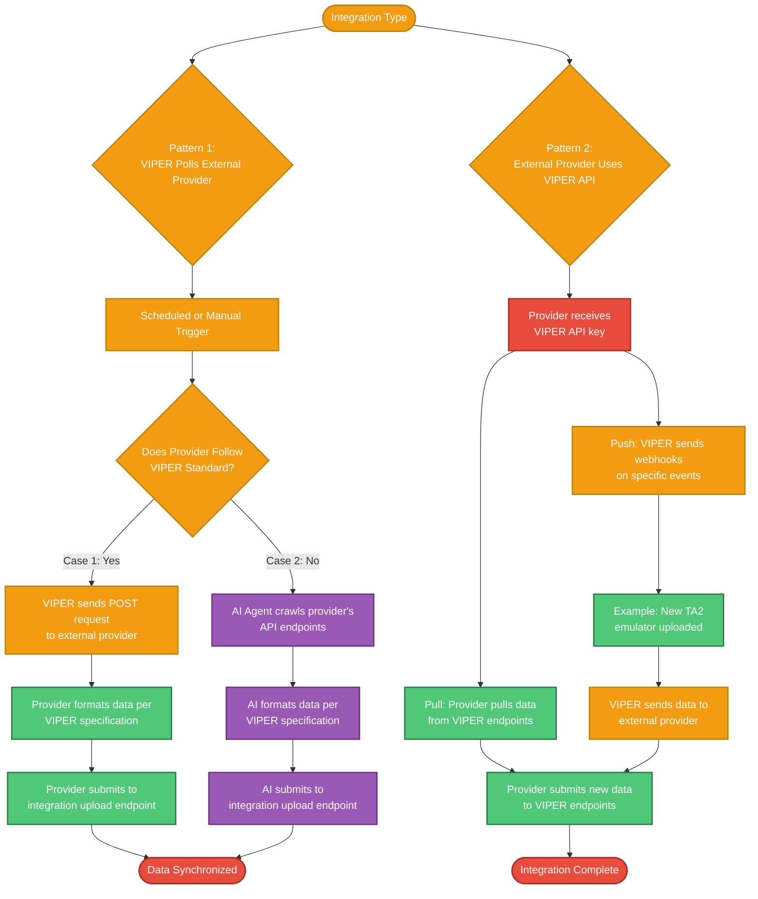

# VIPER Architecture and Supporting Diagrams

## Integrating with external data providers

**VIPER polls external provider**:
* VIPER initiates a request to synchronize with/get data from an external provider (either triggered on a schedule, or manually by a user)
* Two pathways:
    * Case 1. External provider follows standardized integration procedure with VIPER
        * VIPER submits a POST request to external provider requesting latest data for synchronization
        * External provider formats data according to VIPER specification
        * External provider submits data to VIPER's `<assets|vulnerabilities|remediations|deviceArtifacts>/integrationUpload` endpoint
    * Case 2. External provider doesn't follow standardized integration procedure
        * Triggers AI agent to crawl provider's specified API endpoints
        * AI formats data according to internal VIPER specification
        * AI submits data to VIPER's `<assets|vulnerabilities|remediations|deviceArtifacts>/integrationUpload` endpoint

**External provider uses VIPER API**:
* Provider receives VIPER API key
    * Pull: Provider pulls data from VIPER endpoints
    * Push: Provider sends webhooks on specific events (e.g, new TA2 emulator uploaded)
* Provider submits new data to VIPER endpoints

## VMP Blueflow / Helm Integration

This is a subcase of the "VIPER polls external provider" case presented above.

A VMP user configures both a Helm and Blueflow integration, and a schedule on how often to request new data for synchronization.

VIPER just treats the API endpoints for Blueflow/Helm the user configures as blackboxes. In actuality, Blueflow will have an explicit connector for VIPER, and Helm with have an additional API that negotiates between VIPER and Helm, but both facilitate the transfer of external data to VIPER's platform.
