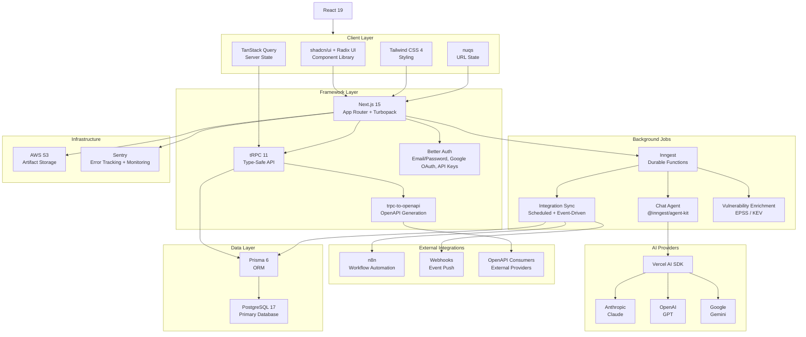
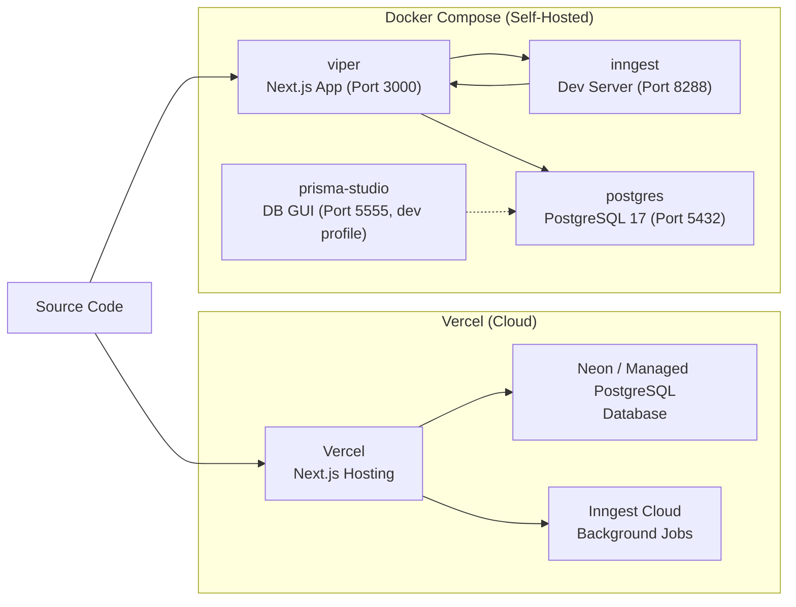
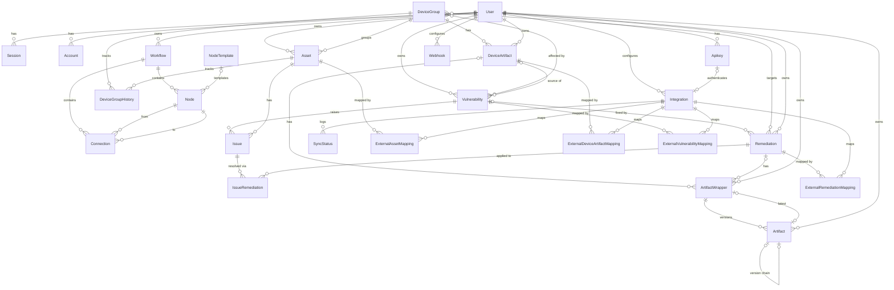

# Viper Tech Stack Architecture

## Platform Architecture

### Key Components

**tRPC** serves as the internal API backbone. All client-server communication flows through tRPC procedures (`baseProcedure` for public endpoints, `protectedProcedure` for authenticated ones). For external consumers, `trpc-to-openapi` auto-generates an OpenAPI spec from the same router definitions, exposed at `/api/v1/` and documented at `/api/openapi.json`.

**Inngest** powers all background and long-running work. It runs durable functions for the AI chat agent (via `@inngest/agent-kit`), scheduled integration syncs (cron-triggered), event-driven integration syncs, and daily vulnerability enrichment against EPSS and KEV feeds. Each function benefits from automatic retries and built-in observability.

**n8n** acts as an external workflow automation layer. When an integration provider doesn't follow Viper's standardized sync protocol, n8n orchestrates the crawl-and-transform pipeline that normalizes external data before submitting it to Viper's integration upload endpoints.

---

## Deployment Pathways

### Vercel (Cloud)

The default cloud deployment. Next.js deploys directly to Vercel with zero configuration. The database runs on a managed PostgreSQL provider (e.g., Neon), and Inngest Cloud handles background job orchestration. This pathway is ideal for production and staging environments where managed infrastructure reduces operational overhead.

### Docker Compose (Self-Hosted)

A fully self-contained deployment defined in `compose.yml` with three services:

| Service | Image | Port | Role |
|---|---|---|---|
| **viper** | Custom (multi-stage Node build) | 3000 | Next.js application; runs Prisma migrations and seed on first start |
| **inngest** | `inngest/inngest:v1.17.2` | 8288 | Inngest dev server; bootstraps from `http://viper:3000/api/inngest` |
| **postgres** | PostgreSQL 17 Alpine | 5432 | Primary database with health checks and persistent volume |

An optional `prisma-studio` service (activated with `--profile dev`) provides a database GUI on port 5555.

This pathway suits local development, air-gapped hospital environments, or deployments where data must remain on-premises.

---

## Data Model

Model relationships from the Prisma schema (`prisma/schema.prisma`), grouped by domain. Field details are omitted; see the schema file for column definitions.

### Domain Legend

| Domain | Models | Purpose |
|---|---|---|
| **Auth** | User, Session, Account, Verification, Apikey | Better Auth identity, sessions, OAuth accounts, and API key access |
| **Workflows** | Workflow, Node, NodeTemplate, Connection | Clinical and security workflow definitions in the node-based editor |
| **Hospital Assets** | Asset, DeviceGroup, DeviceGroupHistory | Medical device inventory grouped by CPE; tracks group membership over time |
| **Vuln Management** | Vulnerability, Issue, Remediation, IssueRemediation | CVE tracking with CVSS/EPSS/KEV scoring; Issues link a vulnerability to a specific asset; remediations can resolve multiple issues |
| **Artifacts** | DeviceArtifact, ArtifactWrapper, Artifact | Versioned file uploads (firmware, emulators, docs) linked to device groups or remediations; version chain via self-referencing FK |
| **Integrations** | Integration, SyncStatus, Webhook | External data provider sync configuration with schedule, auth, and status history; webhooks for outbound event push |
| **External Mappings** | External*Mapping (x4) | Bidirectional ID mapping between Viper entities and external systems; one per resource type for type safety |
