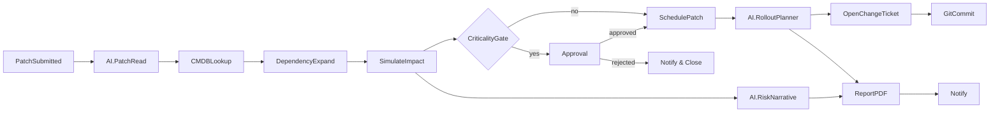

The mission of the PATCH VMP is to help admins **understand the operational
impact** of a vulnerabilities and remediations -- across systems,
safety, and clinical workflows. The VMP focuses on _decisions_, not _graphs_.

**Anchor User Story**

> If I deploy this patch in the ICU monitor today, how many patient systems
> will be offline and for how long? How will treatments be affected?
> What security risk remains if I delay it 24 hours? How do these choices
> affect compliance, safety, and cost?

## Conceptual Model: Clinical Digital Twin

Rather than thinking of the VMP as a raw network simulator, think of it as
hospital digital twin, where each system is a node representing a _clinical
function_, not just an IP address.

- **Nodes:** ICU monitors, infusion pumps, lab analyzers, pharmacy servers,
  nurse electronic medical record (EMR) workstations.
- **Edges:** Data or work flow dependencies ("Lab -> EMR -> Nurse Station ->
  Infusion pump")
- **Attributes:** Vulnerability score, patch status, uptime requirement,
  regulatory criticality.

A core component of the VMP is to enable users to perform hospital
simulations to understand outcomes. There are two main users:

- **Clinicians:** who define _clinical workflows_, e.g., "Lab -> EMR -> Nurse Station
  -> Infusion Pump", where each node is picked from assets. (Represents David's
  Immunotherapy.)
- **Security engineers:** who define _security workflows_, e.g., new
  patch submitted, determine how to best patch all systems.

When a downstream TA proposes a change (e.g., TA-4 asks to apply patch to all
infusion pumps running InsecureOS4.1), the VMP:

- Highlights _affects device nodes_ for the security engineer and _affected
  clinical nodes_ for the clinician.
- Gathers data from the WHS on hospital impact.
- Generates _summary metrics_ for application to the real hospital: downtime,
  risk reduction, clinical impact, regulatory delta.

Example technical walkthrough:

- Trigger: New patch for InsecureOS 4.1 (ICU Monitors and pumps).
- `AI.PatchRead` -> `{requires_reboot: true, expected_downtime: 12m}`
- `DependencyExpansion` -> path `Lab->EMR->Nurse Station -> medical delivery,
life_safety=true`.
- `SimulateImpact` -> ``avg_risk_before=82, after=44, downtime_total=30`
- `AI.RiskDelta` -> `risk_reduction=46%`
- Gate: life-safety + `AI.RolloutPlanner.conf=76` -> approval required
- `AI.RolloutPlaner` -> two 30m ICU windows, stagger
- `AI.ChangeSummary` -> admin-readable markdown
- Artifacts: PDF briefing, PR with `sim/<run-id>/manifest.json`
- Human: Clinical lead approvals with note
- Deterministic: `SchedulePatch` -> tickets, calendar blocks.

## VMP Non-goals

The VMP of course keeps an inventory of
assets, what network they are on, and vulnerabilities, but that information is
gathered in support of assessing impact to **clinical functions
specifically**. The VMP _does not_ replace existing commercial vulnerability
management platforms (what Gartner calls Vulnerability Assessment, such as
Qualys VMDR, Tenable Vulnerability Management, etc).

- On a trigger input, e.g., new patch for InsecureOs 4.1 from TA4.
- Runs an action, like "using WHS, determine how long it takes to install the
  patch". The result is something like "Patch requires restart, 12 min
  downtime".
- Runs a follow-on action to determine how many nodes are affected on the
  network that meet the above workflow.
- Impact summary produced, e.g., "patching now reduces exploit risk 92%
  (determined by CVSS score) on 15 machines, causing 0.5 hours downtime in
  radiology with affected machines."
- Produces recommendation: "Apply to radiology systems at midnight; schedule remaining
  across network for low-load hours."

## Nodes and Wires Mental Model

- **Trigger nodes**: fire on events (e.g., "new patch submitted", "new cve for
  device class", "ticket state changes").
- **Transform nodes:** shape the payload (dependency expansion, data cleanup)
- **AI execution nodes:**: LLM tools that summarize, classify, plan (risk
  write-up, impact narrative, rollout plan).
- **Deterministic execution nodes:** Simulate event in the WHS (patch device)
- **Human in the loop nodes:** Approvals, edits, overrides.
- **Policy Nodes:** Boolean gates (e.g., "Downtime < 15m")

Data flows forward as a JSON payload ("context bag"); nodes append artifacts
(summaries, diffs, charts) and outputs. AI execution nodes make final results
all clinician and engineer-friendly.

Example workflow:



Workflow DSL:

```yaml
apiVersion: arpa.hospital/v1
kind: Workflow
metadata: { name: patch-auto-impact }
spec:
  trigger:
    type: PatchSubmitted
    filter: vendor in ["Microsoft","GE Healthcare"]
  nodes:
    - id: read
      type: AI.PatchRead
      input: { text: "{{trigger.patch.notes}}" }
      output_map:
        { requiresReboot: "$.requires_reboot", components: "$.components" }

    - id: cmdb
      type: CMDBLookup
      input: { targets: "{{trigger.targets}}" }

    - id: dep
      type: DependencyExpand
      input: { assets: "{{cmdb.assets}}" }

    - id: sim
      type: SimulateImpact
      input: { graph: "{{dep.graph}}", patch: "{{trigger.patch}}" }

    - id: gate
      type: CriticalityGate
      input: { services: "{{dep.services}}", policy: "{{policy}}" }

    - id: approve
      type: Approval
      when: "{{gate.requiresApproval}} == true"
      input: { role: "ClinicalLead", summary: "{{sim.summary}}" }

    - id: plan
      type: AI.RolloutPlanner
      when: "{{gate.requiresApproval}} == false || {{approve.state}} == 'approved'"
      input:
        downtime: "{{sim.downtimeMin}}"
        windows: "{{policy.maintenance_windows}}"
        constraints: { concurrency: 2, avoidShiftChange: true }

    - id: ticket
      type: OpenChangeTicket
      input: { plan: "{{plan}}", summary: "{{sim.summary}}" }

    - id: pdf
      type: ReportPDF
      input: { risk: "{{sim}}", plan: "{{plan}}", policy: "{{policy}}" }

    - id: notify
      type: Notify
      input:
        channels:
          - kind: Teams
            to: "#change-control"
          - kind: Email
            to: ["Clinical Leads"]
        message: "Patch {{trigger.patch.id}}: risk ↓ {{sim.avgRiskBefore - sim.avgRiskAfter}}, downtime {{sim.downtimeMin}} min"
```

## AI execution nodes: prompts and guardrails

**AI.PatchRead (extraction, deterministic JSON)**

- System: “Extract ONLY fields per schema. If uncertain, set null.”
- Input: vendor notes, KB pages, CVE pages (retrieved via connector).
- Output: `{requires_reboot: bool|null, services_affected: string[],
downtime_hint_min: number|null}`
- Guard: regex validator + max tokens; reject free-text.

**AI.RiskNarrative (NLG, human-facing)**

- System: “Summarize for non-technical hospital admin; include risk delta, services affected, downtime, life-safety note.”

- Input: SimulationResult, PolicySnapshot.

- Output: markdown paragraph + bullets.

- Guard: never invent numbers; must reference fields by key; unit test with golden samples.

**AI.RolloutPlanner (planning)**

- System: “Propose batches respecting windows, concurrency, blackout rules; ensure total downtime ≤ policy thresholds.”

- Output: array of {window, batch[], concurrency}; validator checks time math.

## Builder UI (MVP)

- Canvas: Draggable nodes with ports; edges show data linage; validation
  badges.
- Top palette: Triggers, filters, transforms, AI, Exec, Human. Each with short
  description and inputs/outputs schemas
- Right panel (Properties): per-node config (static fields)
- Test run pane: inspect live payloads, artifacts preview
- Run history: List of executions with status, duration, approvers, etc.
