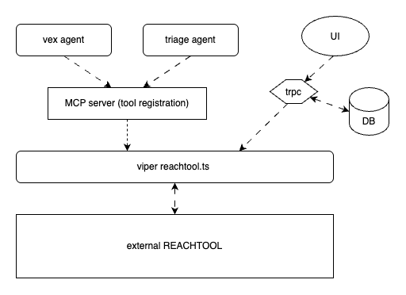
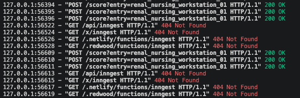

# Reachability

## Running VIPER with ReachTool locally

1. Run the external REACTOOL locally on port `8000`. 
2. In the other terminal, check out branch `VW-425-SPIKE` in viper repo and npm run dev:all
3. npm install (install MCP related packages)
   - [mcp-handler](https://www.npmjs.com/package/mcp-handler)
   - [@modelcontextprotocol/sdk](https://www.npmjs.com/package/@modelcontextprotocol/sdk)
   - `langchain/mcp-adapters`
3. Set up environment variables:
   - `REACHTOOL_BASE_URL=http://localhost:8000`
   - `VIPER_MCP_URL=localhost:3000/api/mcp`

## Operation flow

Search for `// SPIKE VW-425` to find all related code.

| File | Purpose |
|---|---|
| `src/spikes/hawksbill/reachtool.ts` | HTTP client, operation functions, requirement handling |
| `src/spikes/hawksbill/samples` | Network document fixtures |
| `src/app/api/mcp/[transport]/route.ts` | MCP server, tool registration (no business logic) |
| `src/features/inbox/agent/reachability-tools.ts` | Shared MCP client, per-agent tool scoping |
| `vex/context.ts`, `vex/index.ts` | Modified for VEX integration |
| `src/app/(dashboard)/(rest)/reachability` | Client, page-load request |

## How VIPER uses this tool
We can have a background job writes to a table, updates assets on a schedule, stores verdicts, and lets agents and the UI read from that table. 

Currently, `/reachability` is a debug page that dumps raw JSON data. You should see request being made from REACHTOOL console like the screenshot below

Future improvements could include:
- Another tab or panel in the asset detail page showing an entry point and the compromised asset.
- An asset graph that highlights the affected asset (if compromised) and how it's reached.

## Conclusion

A scoring engine: one JSON document in, the same document back with scores attached.

**Catch:** this tool doesn't scan anything and holds no state — it scores the data we hand it. It requires a rich set of asset/vulnerability data. VIPER has two of these but lacks firewall rules, traffic data, and subnet information. So the question isn't whether to use this tool, it's whether VIPER should start holding network topology:

- **If yes** — we can use this tool and make it possible.
- **If no** — we can't answer reachability with this or anything else. Without that data, the tool cannot construct a graph and returns nothing usable.

VIPER currently stores IP per asset but no subnet mask, firewall rules. The tool requires assets and their interfaces. Interfaces are where subnets come from, and subnets are how the tool builds edges at all.

VIPER will need:

| Missing input | Effect |
|---|---|
| Interfaces | No subnets, no edges — reachability unanswerable |
| Open ports | Gives observed services |
| Firewall rules | Gives verified paths |

With none of these, we will most likely get a low-confidence result.
